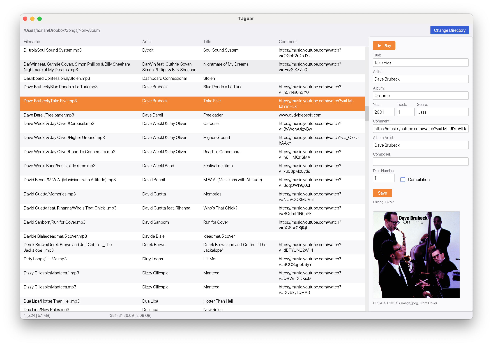

# Taguar

A small desktop app for browsing a directory of audio files and editing their
ID3v2 / primary metadata tags. Built with [Iced](https://iced.rs/) and
[lofty](https://github.com/Serial-ATA/lofty-rs).



## Features

- Select a directory via file dialog or pass one on the command line
- Recursive scan for audio files (`mp3`, `flac`, `m4a`, `m4b`, `mp4`, `ogg`,
  `opus`, `oga`, `wav`, `aiff`, `aif`, `aifc`, `wv`, `ape`)
- Left-pane table: **Filename** (relative path), **Artist**, **Title**,
  **Comment**; proportional columns that adapt to window size
- Right-pane sidebar: compact form for Title, Artist, Album, Album Artist,
  Year, Track, Genre, Composer, Comment, Disc Number, Compilation flag
- Embedded cover art preview with dimensions, size, MIME and picture type
- Read-only ID3v1 section shown when a file has an ID3v1 tag (ID3v1 is never
  written back)
- Save writes through lofty's `TagExt::save_to_path` — for MP3/WAV/AIFF this
  is ID3v2, for FLAC / OGG / M4A it's the format's native primary tag
- Built-in audio playback via [rodio](https://github.com/RustAudio/rodio)
  with a Play / Pause button above the Title field
- Bottom status bar showing selected-file and total duration + size

## Running

```sh
cargo run --release                                  # opens with a dir picker
cargo run --release -- /path/to/music                # opens that directory
cargo run --release -- --help                        # print usage
```

## Format support

Playback goes through rodio with `symphonia-all`, which covers MP3, FLAC,
Vorbis, WAV/PCM/ADPCM, and AAC inside MP4/M4A containers. Symphonia 0.5 has no
working Opus decoder yet, so `.opus` files are routed through a dedicated
decoder built on `libopus` (bundled via the `opus` crate) plus the `ogg` crate
for container parsing.

## License

Licensed under the GNU Affero General Public License v3.0 or later
([AGPL-3.0-or-later](https://www.gnu.org/licenses/agpl-3.0.html)).
See [LICENSE](LICENSE) for the full text.
